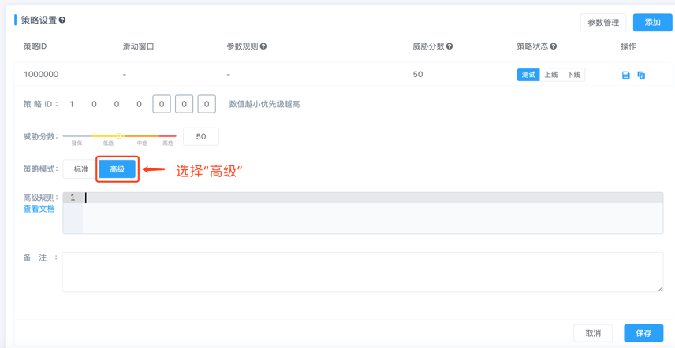
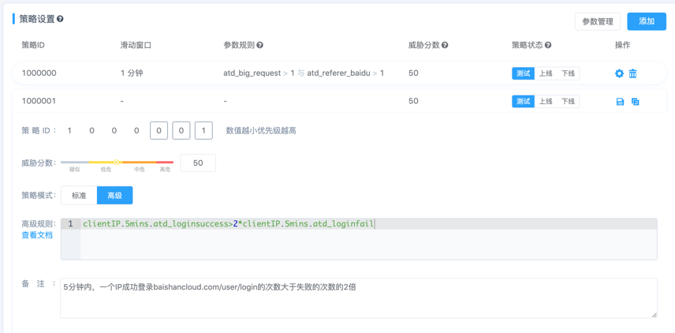

# 可编程对抗-高级规则

设置好参数后，需要设置策略了，对于复杂的策略，不能用简单的逻辑运算来表达的情况，我们可以用高级模式来实现。

如下图所示：在“**策略模式**”中选择“**高级**”。在高级规则中，输入对应的**逻辑表达式**即可。



## 如何写高级规则？
高级规则中就是写一条**逻辑表达式。**

逻辑表达式由比较表达式(CExpression)和逻辑运算符构成。

>1、比较表达式是由算术表达式(AExpression)和比较运算符构成。
>2、算术表达式由常量，参数，算术运算符构成。
```
逻辑运算符支持 and 和 or 两种操作
支持的比较运算符有大于(>)和小于(<)符号
支持的算术运算符有加(+)减(-)乘(*)除(/)
支持常量与参数进行算数运算
另外支持括号运算符
```
### 逻辑表达式【示例1】
```
clientIP.5mins.arg1>2*clientIP.5mins.arg2

在IP分析视角下，5分钟滑动分析窗口，参数arg1大于参数arg2的2倍
```
说明：

| **clientIP**   | 分析视角为IP   | 
|:----|:----|
| **5mins**   | 滑动分析窗口为5分钟   | 
| **arg1**   | 参数1（实际中写“参数管理”中实际的参数名称，此处为示例）   | 
| **arg2**   | 参数2（实际中写“参数管理”中实际的参数名称，此处为示例）   | 

### 逻辑表达式【示例2】
```
id.1min.arg1>2*id.1min.arg2

在ID分析视角下，1分钟滑动分析窗口，参数arg1大于参数arg2的2倍
```
说明：

| **id**   | 分析视角为ID    | 
|:----|:----|
| **1min**   | 滑动分析窗口为1分钟   | 
| **arg1**   | 参数1（实际中写“参数管理”中实际的参数名称，此处为示例）   | 
| **arg2**   | 参数2（实际中写“参数管理”中实际的参数名称，此处为示例）   | 

### 算数表达式构成
```
分析视角.滑动分析窗口.参数名
```
**算数表达式必备3要素：**

**1、分析视角**

分析视角一共有两种IP或ID，请根据该域名的具体情况进行选择

| **IP**   | clientIP   | 
|:----|:----|
| **ID**   | id   | 

**2、滑动分析窗口**

| **5分钟**   | 5mins | 
|:----|:----:|
| **1分钟**   | 1min | 

注意：当前只支持5分钟和1分钟滑动分析窗口。

**3、参数**

可在“参数管理”中查看已设置好的参数，将参数名写出即可。

## 【案例】暴力破解成功
>案例场景详情：5分钟内，一个IP成功登录baishancloud.com/user/login的次数大于失败的次数的2倍，并且成功的次数大于20。

**第一步：设置模型**

在可编程对抗模型中，点击“添加”按钮，【名称】输入“暴力破解成功”。

**第二步：设置参数**

设置两个参数： 

1、成功登录的次数


2、失败登录的次数


**第三步：设置策略**

```
策略模式选择“高级”，在高级规则输入框中输入如下表达式
clientIP.5mins.atd_loginsuccess>2*clientIP.5mins.atd_loginfail and clientIP.5mins.atd_loginsuccess>20
```


