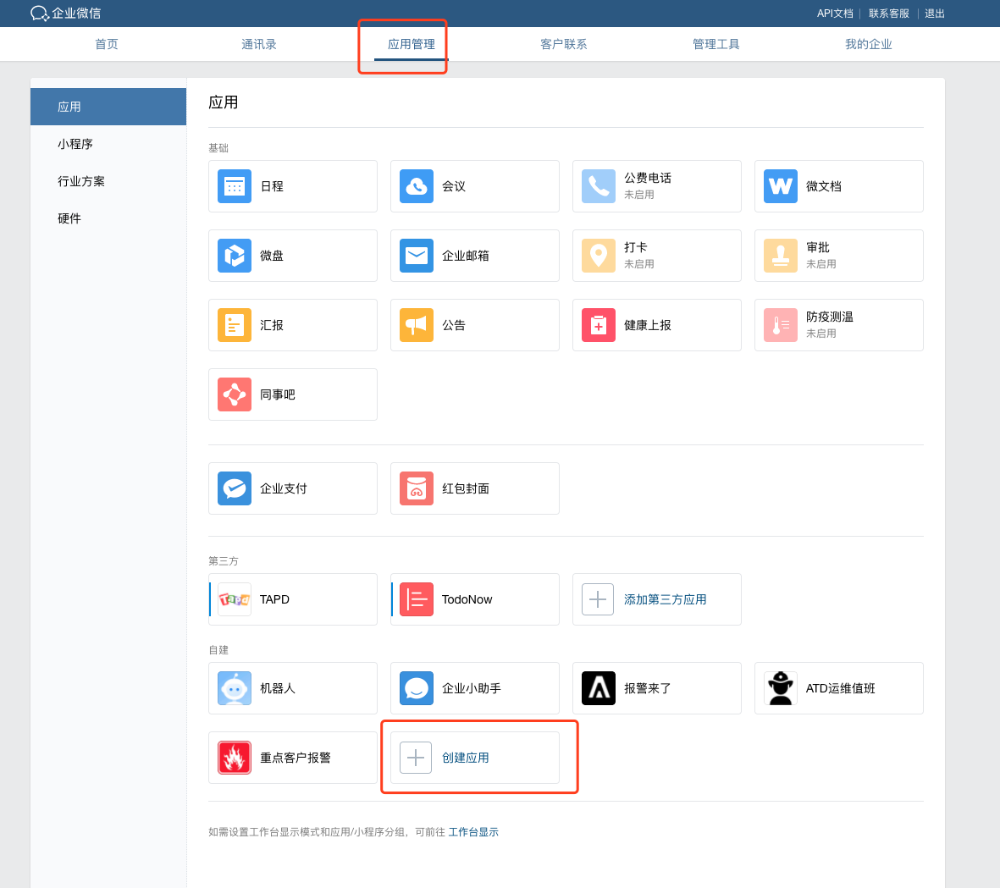
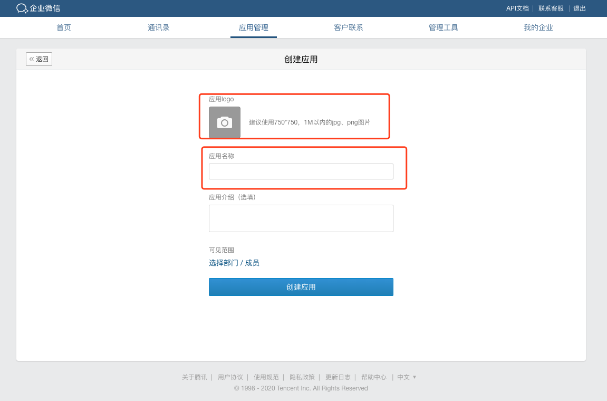
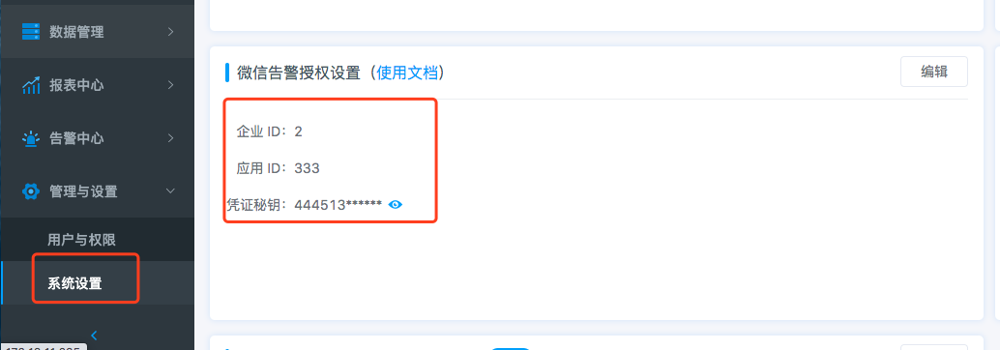
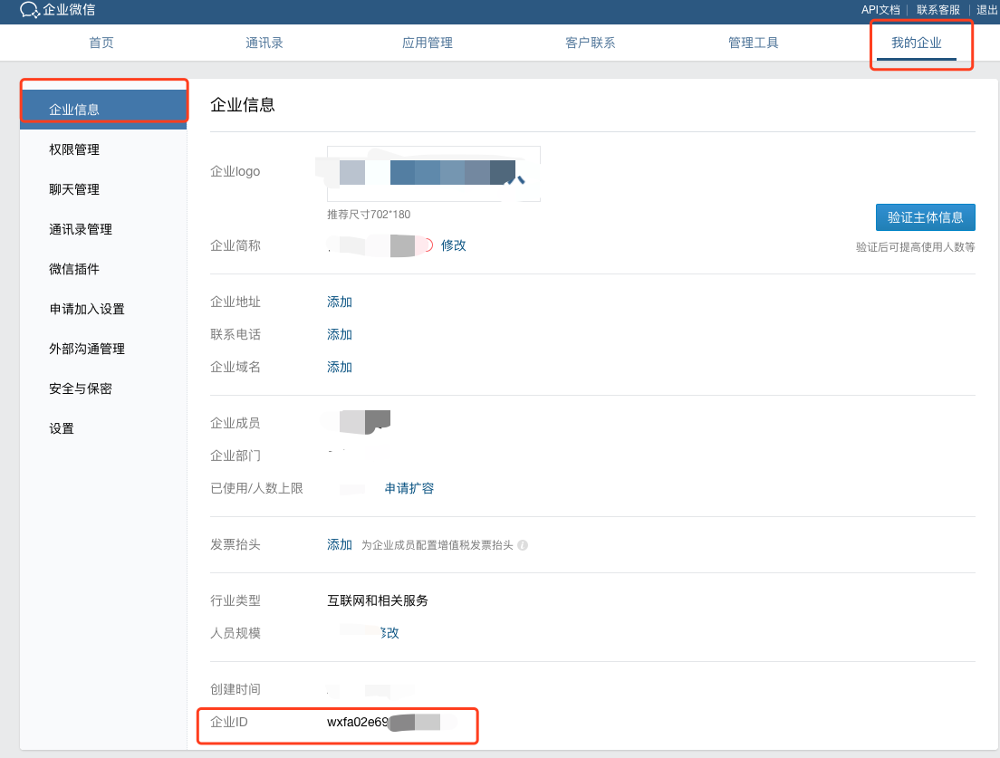
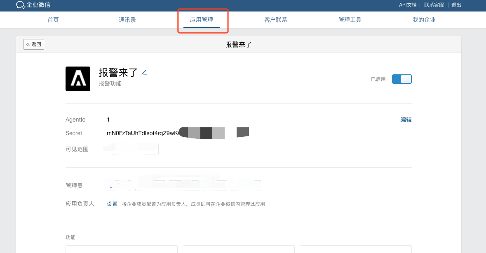
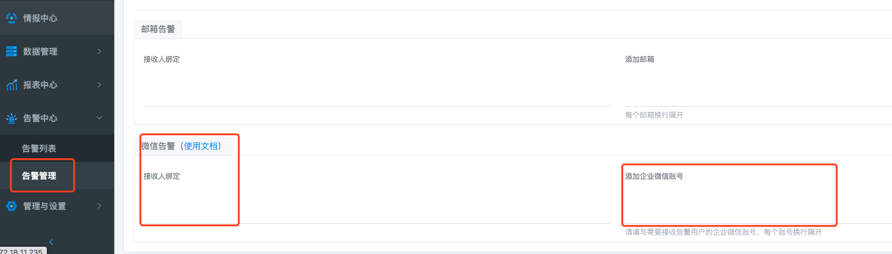
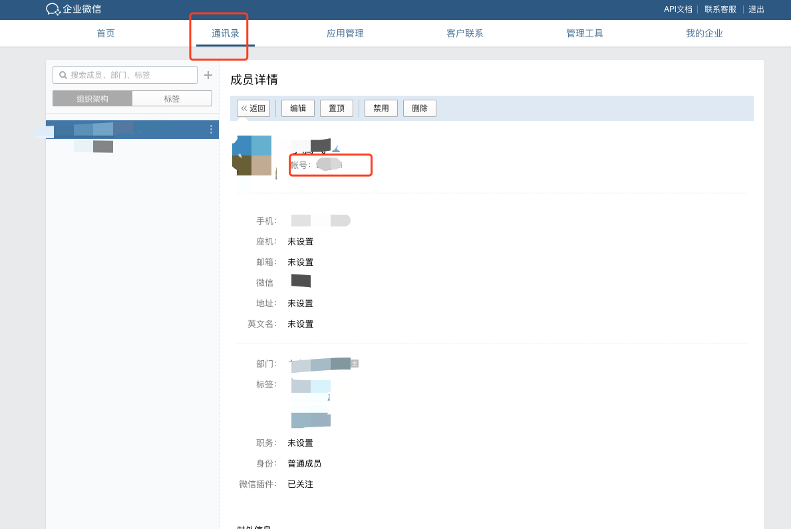


# 微信告警对接操作文档
------

## 概述

> ATD对接微信告警的大致流程如下： 
> 1、注册企业微信 
> 2、在企业微信中，创建接收告警的应用 
> 3、给企业微信添加用户 
> 4、在ATD中填写企业微信授权信息 
> 5、在ATD中添加告警，并进行告警接收方式和接收人设置 

## 1、注册企业微信

对接微信告警之前，需要您有企业微信，因此需要您在企业微信官网进行注册。 
注册地址：https://work.weixin.qq.com 

## 2、在企业微信中，创建接收告警的应用

注册完成并登录后，在【应用管理】导航下，进行【创建应用】，创建用于接收告警的应用，如下图所示： 

## 3、给企业微信添加用户

在企业微信【首页】下方的常用入口进行【添加成员】操作，如下图所示： 

## 4、在ATD中填写企业微信授权信息

在ATD中，超级管理员在【系统配置】下进行微信告警授权设置，需要填写所注册企业微信的企业ID（corpid）、应用ID（agentid）以及所创建用于接收报警的应用的凭证秘钥（corpsecret）,如下图所示： 

企业ID（corpid）、应用ID（agentid）和应用的凭证秘钥（corpsecret）分别在企业微信中的【我的企业】和【应用与小程序】中查看,如下图所示： 

## 5、在ATD中添加告警，并进行告警接收方式和接收人设置

在ATD中的【告警策略】下添加告警，在【接收方式及接收人设置】模块下的进行微信告警设置，绑定已经填写企业微信账号的管理员，或是直接填写需要接收告警的企业微信账号即可，如下图所示： 

企业微信账号可到企业微信通讯录中查看相应用户信息中的账号标识，如下图所示： 

